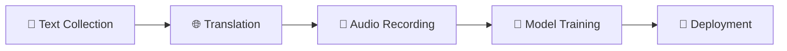

<div align="center">

# 🇧🇮 Kirundi Open Speech & Text Dataset

[](https://opensource.org/licenses/MIT)
[](https://creativecommons.org/licenses/by/4.0/)
[](CONTRIBUTING.md)
[](https://github.com/Sama-ndari/Kirundi_Dataset)

*Building the first large-scale, open-source speech and text dataset for Kirundi*

[🚀 Get Started](#-how-to-contribute) • [📊 Dataset](#-dataset-structure) • [🎯 Roadmap](#-project-roadmap) • [🤝 Community](#-community)

</div>

---

## 🌍 About This Project

**Kirundi** is spoken by over 12 million people, yet it remains a **low-resource language** largely ignored by modern AI systems. We're changing that.

This community-driven initiative aims to create the **first comprehensive, open-source speech and text dataset** for Kirundi, enabling the development of:

### 🎯 Target Applications

| Application | Description | Status |
|-------------|-------------|---------|
| 🎙️ **Speech-to-Text (ASR)** | Transcribe spoken Kirundi into text | 🔄 In Progress |
| 🗣️ **Text-to-Speech (TTS)** | Generate natural-sounding Kirundi speech | 📋 Planned |
| 🌐 **Machine Translation** | Translate between Kirundi and other languages | 📋 Planned |
| 🎧 **Speech Translation** | Direct speech-to-speech translation | 📋 Planned |

> **Our Mission**: *Ikirundi c'acu, ijwi ry'acu* - Preserve and digitize our language for future generations.

## 🚀 How to Contribute

<div align="center">

**Every contribution matters! Choose the way that works best for you:**

</div>

### 📝 Option 1: Add Kirundi Text

<details>
<summary><b>🎯 Goal:</b> Collect clean, high-quality Kirundi sentences</summary>

#### 📋 Steps:
1. **Find Sources**: Look for Kirundi text from:
   - 📰 [Kirundi Wikipedia](https://rn.wikipedia.org)
   - 📚 Public domain books
   - 🗞️ News articles
   - 📖 Educational materials

2. **Clean Text**: Remove all non-essential elements:
   - ❌ Dates and numbers
   - ❌ Editorial marks like `[edit]` or `(Akarorero:)`
   - ❌ Non-Kirundi words
   - ✅ Keep only clean, natural sentences

3. **Add to Dataset**:
   ```bash
   # Add sentences to the text file (one per line)
   echo "Your clean Kirundi sentence" >> scripts/kirundi_prompts_scraped.txt
   
   # Run the appender script
   python scripts/append_to_csv.py
   ```

4. **Submit**: Create a Pull Request with your changes

</details>

---

### 🌐 Option 2: Add French Translations

<details>
<summary><b>🎯 Goal:</b> Provide high-quality Kirundi ↔ French translations</summary>

#### 📋 Requirements:
- ✅ Fluent in both Kirundi and French
- ✅ Understanding of cultural context
- ✅ Attention to linguistic nuances

#### 📋 Steps:
1. Open `metadata.csv`
2. Find rows with empty `french_translation` column
3. Add accurate, natural translations
4. Submit a Pull Request

> **💡 Tip**: Focus on preserving meaning and cultural context, not just literal translation.

</details>

---

### 🎤 Option 3: Record Audio (Most Critical!)

<details>
<summary><b>🎯 Goal:</b> Create high-quality Kirundi speech recordings</summary>

#### 🎧 Recording Requirements:
- 🔇 **Quiet environment** (no background noise)
- 🎙️ **Good microphone** (headset or smartphone)
- 📊 **Technical specs**:
  - Format: WAV (preferred) or MP3
  - Sample Rate: 16kHz or 22.05kHz
  - Channels: Mono (1 channel)
  - Bit Depth: 16-bit

#### 📋 Steps:
1. **Setup**: Fork repository and open `metadata.csv`
2. **Choose**: Find empty `file_path` entries
3. **Record**: Follow our [Recording Guidelines](#-recording-guidelines)
4. **Save**: Place audio in `clips/` folder (e.g., `rn_0001.wav`)
5. **Update Metadata**:
   ```csv
   file_path,kirundi_transcription,french_translation,speaker_id,age,gender
   clips/rn_0001.wav,"Your sentence",,"speaker_001",20s,female
   ```
6. **Submit**: Create Pull Request with audio + metadata

> **🔒 Privacy**: Use anonymous speaker IDs. Your personal information is never required.

</details>

## 🎧 Recording Guidelines

<div align="center">

**📏 Quality Standards for Audio Recordings**

</div>

### 🎯 Recording Best Practices

| Aspect | Requirement | Why It Matters |
|--------|-------------|----------------|
| 🔇 **Environment** | Quiet room, no background noise | Ensures clean training data |
| 🎙️ **Microphone** | Headset mic or smartphone (close to mouth) | Clear audio capture |
| 🗣️ **Speaking Style** | Natural, clear pronunciation | Realistic speech patterns |
| 📝 **Accuracy** | Read exactly as written | Maintains text-audio alignment |

### ⚙️ Technical Specifications

```yaml
Audio Format:
  - Primary: WAV (uncompressed)
  - Alternative: MP3 (high quality)
  
Settings:
  - Sample Rate: 16kHz or 22.05kHz
  - Channels: Mono (1 channel)
  - Bit Depth: 16-bit
  - Duration: Natural sentence length
```

### 🛠️ Recommended Tools

- **🎵 [Audacity](https://www.audacityteam.org/)** (Free, cross-platform)
- **📱 Smartphone voice recorder** (built-in apps work great)
- **💻 Online recorders** (for quick contributions)

---

## 📊 Dataset Structure

Our dataset is organized around `metadata.csv` - the central hub for all project data.

### 📋 Schema Overview

| Column | Type | Description | Example |
|--------|------|-------------|---------|
| `file_path` | String | Relative path to audio file | `clips/rn_0001.wav` |
| `kirundi_transcription` | String | Exact Kirundi sentence | `Amahoro y'Imana abane nawe` |
| `french_translation` | String | High-quality French translation | `Que la paix de Dieu soit avec toi` |
| `speaker_id` | String | Anonymous speaker identifier | `speaker_001` |
| `age` | String | Age group | `20s`, `30s`, `40s+` |
| `gender` | String | Self-identified gender | `male`, `female`, `other` |

### 📁 Directory Structure

```
Kirundi_Dataset/
├── 📄 README.md              # This file
├── 📊 metadata.csv           # Master dataset file
├── 🎵 clips/                 # Audio recordings
│   ├── rn_0001.wav
│   ├── rn_0002.wav
│   └── ...
└── 🔧 scripts/               # Automation tools
    ├── append_to_csv.py      # Add new sentences
    ├── scrapping_kirundi_words.py  # Web scraping
    └── kirundi_prompts_scraped.txt # Raw text input
```

## 🎯 Project Roadmap

<div align="center">

**🚀 Building the Future of Kirundi AI, One Step at a Time**

</div>

### 📈 Development Phases



| Phase | Goal | Target | Status | Progress |
|-------|------|--------|--------|----------|
| **Phase 1** | 📝 Text Collection | 10,000+ sentences | 🔄 **In Progress** |  |
| **Phase 2** | 🌐 French Translation | Complete dataset | 📋 Planned |  |
| **Phase 3** | 🎤 Audio Recording | 20+ hours | 📋 Planned |  |
| **Phase 4** | 🤖 Model Training | ASR/TTS/MT models | 📋 Planned |  |
| **Phase 5** | 🚀 Public Release | Open-source models | 🎯 Future |  |

### 🎯 Current Milestones

- ✅ **Repository Setup**: Project structure and automation scripts
- ✅ **Data Pipeline**: Automated text processing and validation
- 🔄 **Community Building**: Growing contributor base
- 📋 **Quality Standards**: Establishing recording and translation guidelines

---

## 🤝 Community

<div align="center">

**Join our mission to preserve and digitize Kirundi!**

[](https://discord.gg/your-server)
[](https://t.me/your-group)

</div>

### 🌟 Contributors

We thank all our amazing contributors who are helping build this dataset:

<!-- Contributors will be automatically added here -->
<a href="https://github.com/Sama-ndari/Kirundi_Dataset/graphs/contributors">
  
</a>

### 📊 Current Stats

| Metric | Count |
|--------|-------|
| 📝 **Total Sentences** | 180+ |
| 🎤 **Audio Recordings** | 0 |
| 🌐 **Translations** | 0 |
| 👥 **Contributors** | Growing! |

---

## ⚖️ License

<div align="center">

| Component | License | Details |
|-----------|---------|---------|
| 🔧 **Code & Scripts** | [](https://opensource.org/licenses/MIT) | Free to use, modify, and distribute |
| 📊 **Dataset** | [](https://creativecommons.org/licenses/by/4.0/) | Open access with attribution |

</div>

### 📜 What This Means

- ✅ **Free to use** for research, commercial, and educational purposes
- ✅ **Attribution required** when using the dataset
- ✅ **No restrictions** on derivative works
- ✅ **Open source** forever

---

<div align="center">

## 💝 Support This Project

**🇧🇮 *Ikirundi c'acu, ijwi ry'acu* 🇧🇮**

*Our language, our voice - Thank you for helping build the future of Kirundi AI*

---

**⭐ Star this repository** • **🔄 Share with friends** • **🤝 Contribute today**

[](https://github.com/Sama-ndari/Kirundi_Dataset)
[](https://github.com/Sama-ndari)

</div>