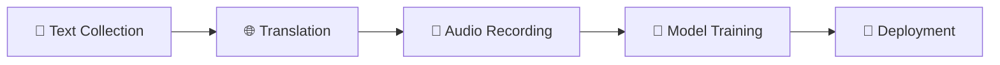

---
language:
  - rn
license: cc-by-4.0
task_categories:
  - automatic-speech-recognition
  - text-to-speech
  - translation
pretty_name: Kirundi Open Speech & Text Dataset
tags:
  - kirundi
  - low-resource
  - audio
  - speech
size_categories:
  - 1K<n<100K
---

<div align="center">

# 🇧🇮 Kirundi Open Speech & Text Dataset

[](https://opensource.org/licenses/MIT)
[](https://creativecommons.org/licenses/by/4.0/)
[](CONTRIBUTING.md)
[](https://github.com/Ijwi-ry-Ikirundi-AI/Kirundi_Dataset)

_Building the first large-scale, open-source speech and text dataset for Kirundi_

[🚀 Get Started](#-how-to-contribute) • [📊 Dataset](#-dataset-structure) • [🎯 Roadmap](#-project-roadmap) • [🫱🏿‍🫲🏾 Community](#-community)

</div>

---

## 🌍 About This Project

**Kirundi** is spoken by over 12 million people, yet it remains a **low-resource language** largely ignored by modern AI systems. We're changing that.

This community-driven initiative aims to create the **first comprehensive, open-source speech and text dataset** for Kirundi, enabling the development of:

### 🎯 Target Applications

| Application                 | Description                                   | Status         |
| --------------------------- | --------------------------------------------- | -------------- |
| 🎙️ **Speech-to-Text (ASR)** | Transcribe spoken Kirundi into text           | 🔄 In Progress |
| 🗣️ **Text-to-Speech (TTS)** | Generate natural-sounding Kirundi speech      | 📋 Planned     |
| 🌐 **Machine Translation**  | Translate between Kirundi and other languages | 📋 Planned     |
| 🎧 **Speech Translation**   | Direct speech-to-speech translation           | 📋 Planned     |

> **Our Mission**: _Ikirundi cacu, Ijwi ryacu_ - Preserve and digitize our language for future generations.


## 🚀 How to Contribute

This project has two "homes," so your contribution flow depends on _what_ you are adding:

- **For Text, Translations, or Code:** Use our [GitHub Repository](https://github.com/Ijwi-ry-Ikirundi-AI/Kirundi_Dataset).
- **For Audio:** You **must** use our [Hugging Face Repository](https://huggingface.co/datasets/Ijwi-ry-Ikirundi-AI/Kirundi_Open_Speech_Dataset).

<div align="center">

**Every contribution matters! Choose the option that works best for you:**

</div>

### 📝 Option 1: Text / Translation Contribution (via GitHub)

<details>
<summary><b>🎯 Goal:</b> Provide clean, high-quality Kirundi sentences and translations</summary>

### ✔️ What you are allowed to contribute:

- New Kirundi sentences
- Kirundi → French translations
- Kirundi → English translations
- (Optional) Domain and Source metadata

### ✔️ Required columns:

- `Kirundi_Transcription` → **REQUIRED**
- `French_Translation` or `English_Translation` → **REQUIRED (at least one)**
- Do **NOT** fill anything in the Audio or Admin columns.

---

### 🔧 Steps to Contribute

#### 1. **Fork & Clone**
Fork and clone the dataset repository: https://github.com/Ijwi-ry-Ikirundi-AI/Kirundi_Dataset

#### 2. Quality & Normalization Standards

To ensure high-quality ASR/TTS models, every Kirundi sentence must follow strict normalization rules.

---

##### Transcription Normalization (Kirundi_Transcription)

| Rule | Description | Why It Matters |
|------|-------------|----------------|
| **Full Spelling** | No abbreviations, numbers, symbols. (e.g., “4” → “cane”, avoid &, @, etc.) | Models learn sounds, not numeric shortcuts. |
| **Ending Punctuation** | Every sentence ends with `.`, `?`, or `!` | Helps TTS detect sentence boundaries and tone. |
| **Initial Capitalization** | Capitalize only the first word or proper nouns | Supports automatic capitalization training. |
| **Diacritics Required** | Keep tonal/long-vowel marks (â, ū, é, í, etc.) if the source uses them | Crucial for accurate pronunciation & prosody. |
| **Length Limits** | Ideal: 4–25 words (max 30) | Ensures easy recording and strong ASR alignment. |

---

#### 3. **Add Your Data**

Open `metadata.csv` and fill in only the following:

| Column                  | Required            | Notes                                  |
| ----------------------- | ------------------- | -------------------------------------- |
| `Kirundi_Transcription` | ✔️ Yes              | The original Kirundi sentence          |
| `French_Translation`    | ✔️ Yes (or English) | Provide high-quality translation       |
| `English_Translation`   | Optional            | If omitted, it will be generated by AI |
| `Domain`                | Optional            | Grammar, Conjugation, Culture, etc.    |
| `Source`                | Optional            | URL, book, document, etc.              |

#### ❌ Do NOT modify these columns:
- `ID` — Auto-assigned by the split generation pipeline
- `File_Path` — Filled when audio is recorded
- `Duration` — Computed from audio files
- `Speaker_id`, `Age`, `Gender` — Filled by the audio contributor
- `Audio_Status` — Managed by the audio pipeline
- `Machine_Suggestion` — AI-generated draft
- `word_count`, `char_count` — Computed automatically

These fields are automatically filled by scripts or by the admin.

---

### 🧩 Additional Tools Included

You may also use the built-in scraping pipeline:

#### 4. **Add Sentences to the Text File**

Add new clean Kirundi sentences (one per line) to: kirundi_prompts_scraped.txt

#### 5. **Run the Appender Script**

Automatically append your sentences to `metadata.csv` without duplicates:

```bash
python scripts/append_to_csv.py
```

This ensures consistency and keeps the dataset clean.

5. Submit a Pull Request

Commit → push to your fork → open a Pull Request on GitHub.

</details>

### 🎤 Option 2: Record Audio (via Hugging Face - CRITICAL!)

<details>
<summary><b>🎯 Goal:</b> Create high-quality Kirundi speech recordings</summary>

**This is the most important step and MUST be done on Hugging Face.**

#### 📋 Step 0: First-Time Setup

1.  **Go to Hugging Face:** Fork the [Hugging Face Dataset](https://huggingface.co/datasets/Ijwi-ry-Ikirundi-AI/Kirundi_Open_Speech_Dataset).
2.  **Clone Your Fork:**
    ```bash
    # Clone your fork from Hugging Face (replace "Your-HF-Username")
    git clone https://huggingface.co/datasets/Your-HF-Username/Kirundi_Open_Speech_Dataset
    cd Kirundi_Open_Speech_Dataset
    ```
3.  **Install Git LFS:**
    ```bash
    git lfs install
    ```
    _(This is a one-time setup on your computer. You can download Git LFS from [git-lfs.github.com](https://git-lfs.github.com/))_

#### 📋 Step 1: Record & Update

1.  **Find a Task:** Open `metadata.csv` and find a row with an empty `file_path`.
2.  **Record:** Record the audio for that `kirundi_transcription` following our [Recording Guidelines](#-recording-guidelines).
3.  **Save:** Save your audio file (e.g., `rn_0001.wav`) into the `clips/` folder.
4.  **Update CSV:** Fill in your row in `metadata.csv` (add the `file_path`, your `speaker_id`, `age`, and `gender`).

##### Audio Metadata Normalization

| Column     | Required Format                             | Explanation                                 |
| ---------- | ------------------------------------------- | ------------------------------------------- |
| Speaker_id | Anonymous format: `S_01_M`                  | Ensures privacy and dataset consistency.    |
| Age        | General ranges (e.g., `20s`, `30s`, `40s+`) | Allows diversity without exposing real age. |
| Duration   | Float number (e.g., `3.15`)                 | Required for proper text–audio alignment.   |

#### 📋 Step 2: Submit

1.  **Push to Hugging Face:**
    ```bash
    git add .
    git commit -m "Added new audio clip clips/rn_0001.wav"
    git push
    ```
    Git LFS will automatically upload your audio to Hugging Face LFS storage.
2.  **Submit PR:** Go to your Hugging Face fork and submit a **Pull Request on Hugging Face**.

### ⚠️ IMPORTANT :

**Les fichiers audio NE doivent PAS être envoyés sur GitHub.  
Uniquement sur Hugging Face.**

---

## 🎧 Recording Guidelines

<div align="center">

**📏 Quality Standards for Audio Recordings**

</div>

### 🎯 Recording Best Practices

| Aspect                | Requirement                                | Why It Matters                 |
| --------------------- | ------------------------------------------ | ------------------------------ |
| 🔇 **Environment**    | Quiet room, no background noise            | Ensures clean training data    |
| 🎙️ **Microphone**     | Headset mic or smartphone (close to mouth) | Clear audio capture            |
| 🗣️ **Speaking Style** | Natural, clear pronunciation               | Realistic speech patterns      |
| 📝 **Accuracy**       | Read exactly as written                    | Maintains text-audio alignment |

### ⚙️ Technical Specifications

```yaml
Audio Format:
  - Primary: WAV (uncompressed)
  - Alternative: MP3 (high quality)

Settings:
  - Sample Rate: 16kHz or 22.05kHz
  - Channels: Mono (1 channel)
  - Bit Depth: 16-bit
  - Duration: Natural sentence length
```

### 🛠️ Recommended Tools

- **🎵 [Audacity](https://www.audacityteam.org/)** (Free, cross-platform)
- **📱 ASR Voice Recorder** (Android app - excellent for high-quality recordings)
- **📱 Smartphone voice recorder** (built-in apps work great)
- **💻 Online recorders** (for quick contributions)

---
</details>


</details>

## 🔄 Git Workflow (For Maintainers)

<div align="center">

**🎯 How to Sync Changes Across GitHub and Hugging Face**

</div>

> ⚠️ **Important**: Never push directly to `main` on GitHub. Always use feature branches and Pull Requests.

### 📋 One-Time Setup

```bash
# Add Hugging Face as a remote (if not already added)
git remote add hf https://huggingface.co/datasets/Ijwi-ry-Ikirundi-AI/Kirundi_Open_Speech_Dataset.git

# Add GitHub as a remote (if not already added)
git remote add origin https://github.com/Ijwi-ry-Ikirundi-AI/Kirundi_Dataset

# Verify your remotes
git remote -v

# Install Git LFS (Mac with Homebrew)
brew install git-lfs

# Initialize LFS in your user account
git lfs install
```

### 📤 Standard Workflow: GitHub (via PR) → Hugging Face

```bash
# 1. Create a feature branch
git checkout -b feature/your-feature-name

# 2. Make your changes, then stage and commit
git add .
git commit -m "Your descriptive commit message"

# 3. Push to GitHub (creates branch on remote)
git push origin feature/your-feature-name

# 4. Go to GitHub and create a Pull Request → Admin will Merge to main

# 5. After PR is merged, pull main locally
git checkout main
git pull origin main

# 6. Push to Hugging Face
git push hf main
```

### 🔧 How Git LFS Works

Git LFS (Large File Storage) keeps your repo fast by storing **pointer files** (tiny text files) in Git, while the actual large files live on a separate server.

```
┌─────────────────────────────────────────────────────────────┐
│                     YOUR LOCAL REPO                          │
│  clips/proverbs/krd_000089_proverbs.wav (actual 182KB file) │
└─────────────────────────────────────────────────────────────┘
                          │
            ┌─────────────┴─────────────┐
            ▼                           ▼
┌───────────────────────┐   ┌───────────────────────┐
│       GITHUB          │   │    HUGGING FACE       │
├───────────────────────┤   ├───────────────────────┤
│ Pointer file: 131B ✓  │   │ Pointer file: 131B ✓  │
│ LFS Object: 182KB ✓   │   │ LFS Object: 182KB ✓   │
└───────────────────────┘   └───────────────────────┘
```

When you push to either remote, Git LFS automatically uploads the actual audio files to that remote's LFS server. The Git repo stays small because it only contains tiny pointer files.

---

## 📊 Dataset Structure

Our dataset is organized around `metadata.csv` - the central hub for all project data.

### 📋 Schema Overview (`metadata.csv`)

| Column                  | Type   | Description                      | Example                             |
| ----------------------- | ------ | -------------------------------- | ----------------------------------- |
| `ID`                    | String | Unique identifier                | `krd_000001_jokes`                  |
| `File_Path`             | String | Relative path to audio file      | `clips/jokes/20260131_S01_M_jokes_krd_000001.wav` |
| `Kirundi_Transcription` | String | Exact Kirundi sentence           | `Amahoro y'Imana abane nawe`        |
| `French_Translation`    | String | High-quality French translation  | `Que la paix de Dieu soit avec toi` |
| `English_Translation`   | String | High-quality English translation | `May the peace of God be with you`  |
| `Domain`                | String | Topic or category                | `jokes`, `proverbs`, `grammar`      |
| `Machine_Suggestion`    | String | AI-generated translation draft   | _(auto-filled)_                     |
| `Source`                | String | Origin of the sentence           | URL, book, document                 |
| `Duration`              | Float  | Audio duration in seconds        | `3.15`                              |
| `Speaker_id`            | String | Anonymous speaker identifier     | `S01_M`, `S02_M`                    |
| `Age`                   | String | Age group                        | `20s`, `30s`, `40s+`                |
| `Gender`                | String | Self-identified gender           | `male`, `female`, `other`           |
| `Audio_Status`          | String | Recording status                 | `pending`, `recorded`, `validated`  |
| `word_count`            | Int    | Number of words in Kirundi text  | `8`                                 |
| `char_count`            | Int    | Number of characters             | `43`                                |

### 🎙️ Audio Status Tracking

| Status       | Description                                    |
| ------------ | ---------------------------------------------- |
| `pending`    | Not recorded yet                               |
| `recorded`   | Audio file exists, awaiting peer-review        |
| `validated`  | Peer-review passed, ready for training         |
| `rejected`   | Quality issues, needs re-recording             |

### 📁 Directory Structure

```
Kirundi_Dataset/
├── 📄 README.md                    # This file
├── 📄 CONTRIBUTING.md              # Contribution guidelines
├── 📊 metadata.csv                 # Master dataset (source of truth)
├── 📂 final_dataset_splits/        # Recording tasks (~100 sentences each)
│   ├── final_dataset_part_001.csv
│   ├── final_dataset_part_002.csv
│   └── ... (30 files)
├── 📂 exports/                     # Dated exports (gold, needs-translation)
├── 🎵 clips/                       # Audio recordings (Git LFS → Hugging Face)
│   ├── proverbs/
│   ├── action-verbs/
│   ├── grammar/
│   └── ... (19 domain folders)
└── 🔧 scripts/
    ├── dataset_manager.ipynb       # Data management notebook (audit, clean, export, splits)
    ├── audio_pipeline.py           # Audio processing + status management (unified CLI)
    ├── append_to_csv.py            # Append new sentences from text file to metadata.csv
    └── kirundi_prompts_scraped.txt # Raw text input for append_to_csv.py
```

### 🎙️ Audio Recording Workflow

#### Daily Recording Steps

1. **Record**: Record audio for sentences with `Audio_Status: pending` in `final_dataset_splits/`
2. **Name & Place**: Save files as `krd_[ID]_[domain].wav` in the correct `clips/[domain]/` folder
3. **Process**: Run `audio_pipeline.py process` (applies VAD, normalization, denoising)
4. **Update CSV**: Run `audio_pipeline.py update` to sync audio files with split CSV metadata
5. **Validate/Reject**: Run `audio_pipeline.py validate` or `reject` after peer review
6. **Commit**: Create feature branch, commit changes, push to GitHub
7. **Sync HF**: After PR merge, push to Hugging Face

#### Quick Reference Commands

```bash
source .venv/bin/activate

# Step 1: Process raw audio (VAD + normalize + denoise)
python scripts/audio_pipeline.py process clips/proverbs/

# Step 2: Scan clips/ and update split CSVs with file paths & durations
python scripts/audio_pipeline.py update

# Step 3: Validate or reject after peer review
python scripts/audio_pipeline.py validate krd_000089
python scripts/audio_pipeline.py reject krd_000090 --reason "Background noise"

# Step 4: Check overall progress
python scripts/audio_pipeline.py summary

# Step 5: Create branch and commit
git checkout -b audio/proverbs-batch-1
git add .
git commit -m "Add 50 proverbs recordings - Speaker S01_M"

# Step 6: Push to GitHub (for PR)
git push origin audio/proverbs-batch-1

# Step 7: After PR is merged, sync to Hugging Face
git checkout main && git pull origin main && git push hf main
```

### 🔧 Audio Pipeline Commands

```bash
python scripts/audio_pipeline.py process clips/proverbs/file.wav   # Single file
python scripts/audio_pipeline.py process clips/proverbs/            # Entire folder
python scripts/audio_pipeline.py process clips/                     # All clips
python scripts/audio_pipeline.py update                             # Sync clips → CSVs
python scripts/audio_pipeline.py validate krd_000089                # Mark as validated
python scripts/audio_pipeline.py reject krd_000090                  # Mark as rejected
python scripts/audio_pipeline.py summary                            # Status dashboard
```

### 🛠️ Useful Commands

| Task | Command |
|------|---------|
| Check what's changed | `git status` |
| See pending recordings | Check CSV for `Audio_Status = pending` |
| Verify LFS tracking | `git lfs ls-files` |
| Check LFS file sizes | `git lfs status` |
| List all remotes | `git remote -v` |

### 🔄 Data Pipeline

The dataset follows a managed lifecycle controlled by `scripts/dataset_manager.ipynb`:

```
metadata.csv (source of truth)
     │
     ├──▶ Export Gold (KR+FR+EN complete) ──▶ exports/kirundi_gold_YYYYMMDD.csv
     ├──▶ Export Needs Translation         ──▶ exports/kirundi_needs_translation_YYYYMMDD.csv
     │
     ├──▶ Clean text for recording (strip quotes, dialogue markers, excess punctuation)
     │
     └──▶ Generate Recording Splits (merge-intelligent)
              │
              ├── Matches existing splits by (Kirundi + French) composite key
              ├── Preserves audio data for already-recorded sentences
              ├── Assigns new IDs to new sentences
              └── Writes to final_dataset_splits/ (~100 rows each)

final_dataset_splits/ (distributed for recording)
     │
     ├──▶ Contributors record audio ──▶ clips/[domain]/
     ├──▶ audio_pipeline.py process  ──▶ VAD + normalize + denoise
     ├──▶ audio_pipeline.py update   ──▶ Sync clips → split CSVs
     ├──▶ audio_pipeline.py validate ──▶ Mark as validated after peer review
     │
     └──▶ Sync Back: validated rows ──▶ metadata.csv (enriched with audio data)
              └── Validated rows are removed from splits (done!)
```

### 🌐 Contribution App

Non-technical contributors can help translate sentences using our web app:
**[kirundi-contribution-app](https://www.samandari.dev/kirundi-contribution-app/)**

The app fetches `metadata.csv` from Hugging Face and offers three modes:
- **Easy**: Translate untranslated Kirundi sentences to French
- **Medium**: Translate French prompts to Kirundi
- **Hard**: Submit entirely new Kirundi-French sentence pairs

Submissions are collected via Google Sheets and merged back into `metadata.csv` using `merge_contributions.py`.

### 📏 Audio Naming Convention

```
Path format: clips/[DOMAIN]/[DATE]_[SPEAKER]_[DOMAIN]_[SENTENCE_ID].wav
Example: clips/jokes/20260131_S01_M_jokes_krd_000001.wav

Speaker IDs:
- S01_M: César (Male)
- S02_M: Arsène (Male)

Domain folders (19 total):
proverbs, action-verbs, grammar, vocabulary, general, emotions,
jokes, adjectives, idioms, language, geography, food, greetings,
politeness, location, apologies, advice, time, adverbs
```

## 🎯 Project Roadmap

<div align="center">

**🚀 Building the Future of Kirundi AI, One Step at a Time**

</div>

### 📈 Development Phases


```mermaid
graph LR
    A[📝 Text Collection] --> B[🌐 Translation]
    B --> C[🎤 Audio Recording]
    C --> D[🤖 Model Training]
    D --> E[🚀 Deployment]
```

| Phase       | Goal                  | Target             | Status             | Progress                                  |
| ----------- | --------------------- | ------------------ | ------------------ | ----------------------------------------- |
| **Phase 1** | 📝 Text Collection    | 10,000+ sentences  | 🔄 In Progress     |  |
| **Phase 2** | 🌐 Translation        | Complete dataset   | 🔄 In Progress     |  |
| **Phase 3** | 🎤 Audio Recording    | 20+ hours          | 🔄 **In Progress** |   |
| **Phase 4** | 🤖 Model Training     | ASR/TTS/MT models  | 📋 Planned         |   |
| **Phase 5** | 🚀 Public Release     | Open-source models | 🎯 Future          |   |

### 🎯 Current Milestones

- ✅ **Repository Setup**: Dual-repo architecture (GitHub + Hugging Face)
- ✅ **Data Pipeline**: Automated text processing, cleaning, and validation
- ✅ **Dataset Manager**: Jupyter notebook for audit, translation, export, and split generation
- ✅ **Audio Pipeline**: Unified CLI for processing, status tracking, and validation
- ✅ **Contribution App**: [Web app](https://www.samandari.dev/kirundi-contribution-app/) for crowdsourcing translations
- ✅ **Dataset Split**: 2,903 gold sentences split into 30 files for recording
- ✅ **Merge-Intelligent Splits**: Auto-preserves audio data when regenerating splits
- 🔄 **Audio Recording**: Recording Kirundi speech (102/2,903 complete)
- 📋 **Model Training**: Fine-tuning Whisper for Kirundi ASR

---

## 🫱🏿‍🫲🏾 Community

<div align="center">

**Join our mission to preserve and digitize Kirundi!**

[](https://discord.gg/your-server)
[](https://t.me/your-group)
[](https://chat.whatsapp.com/your-group)

</div>

### 🌟 Contributors

We thank all our amazing contributors who are helping build this dataset:

<a href="https://github.com/Ijwi-ry-Ikirundi-AI/Kirundi_Dataset/graphs/contributors">
  
</a>
<a href="https://github.com/lionel-k">
  
</a>

### 📊 Current Stats

| Metric                       | Count |
| ---------------------------- | ----- |
| 📝 **Total Sentences**       | 4,737 |
| 🏆 **Gold (KR+FR+EN)**      | 2,911 |
| 🎤 **Audio Recordings**      | 102   |
| ⏳ **Pending Recording**     | 2,801 |
| 📂 **Recording Splits**      | 30    |
| 👥 **Contributors**          | 3     |

---

## ⚖️ License

<div align="center">

| Component             | License                                                                                                                        | Details                             |
| --------------------- | ------------------------------------------------------------------------------------------------------------------------------ | ----------------------------------- |
| 🔧 **Code & Scripts** | [](https://opensource.org/licenses/MIT)                     | Free to use, modify, and distribute |
| 📊 **Dataset**        | [](https://creativecommons.org/licenses/by/4.0/) | Open access with attribution        |

</div>

### 📜 What This Means

- ✅ **Free to use** for research, commercial, and educational purposes
- ✅ **Attribution required** when using the dataset
- ✅ **No restrictions** on derivative works
- ✅ **Open source** forever

---

<div align="center">

## 💝 Support This Project

**🇧🇮 _Ikirundi cacu, Ijwi ryacu_ 🇧🇮**

_Our language, our voice - Thank you for helping build the future of Kirundi AI_

---

**⭐ Star this repository** • **🔄 Share with friends** • **🫱🏿‍🫲🏾Contribute today**

[](https://github.com/Sama-ndari/Kirundi_Dataset)
[](https://github.com/Sama-ndari)

</div>
